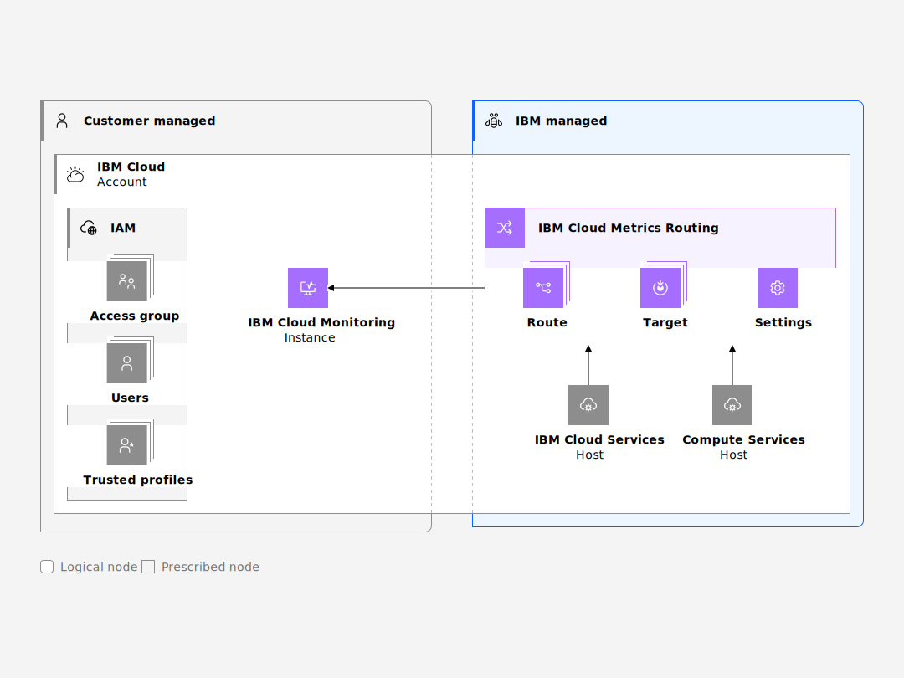

---

copyright:
  years:  2023, 2024
lastupdated: "2024-01-22"

keywords:

subcollection: metrics-router

---

{{site.data.keyword.attribute-definition-list}}

# Learning about {{site.data.keyword.metrics_router_full_notm}} architecture and workload isolation
{: #compute-isolation}

Review the following sample architecture for {{site.data.keyword.metrics_router_full_notm}}, and learn more about different isolation levels so that you can choose the solution that best meets the requirements of the workloads that you want to run in the cloud.
{: shortdesc}

## {{site.data.keyword.metrics_router_full_notm}} architecture
{: #architecture}

{{site.data.keyword.metrics_router_full_notm}} is a multi-tenant, regional service that is available in {{site.data.keyword.cloud_notm}}. With {{site.data.keyword.metrics_router_full_notm}}, you can manage collection and routing of metrics in your account.

The following figure shows the high level architecture for {{site.data.keyword.metrics_router_full_notm}}:

{: caption="Figure 1. {{site.data.keyword.metrics_router_full_notm}} sample architecture" caption-side="bottom"}

{{site.data.keyword.metrics_router_full_notm}} is deployed and managed per region. See [List of supported regions](/docs/metrics-router?topic=metrics-router-regions). In each region, the service runs in three physically separate data centers to ensure availability. All data and the configuration for each service deployment is retained within the region in which it is hosted.

You can use the {{site.data.keyword.metrics_router_full_notm}} CLI, the {{site.data.keyword.metrics_router_full_notm}} API, and {{site.data.keyword.metrics_router_full_notm}} Terraform to manage the service in your account.

You can configure the {{site.data.keyword.metrics_router_full_notm}} settings to define how to manage metrics globally in your account. You can configure whether you want to use private endpoints only, location of the metadata that is required by the service to run, default destinations in case you do not set a rule for a region where you operate, and more.

Before you can configure the resources that define how to manage metrics in the account, you must define a `Primary metadata region`. The `Primary metadata region` defines the location where metadata about your account and resources is stored. You can optionally configure a `Backup metadata region`. Metadata includes information about the routing rules, the account settings that define how to manage metrics in your account, and target details, including credentials that are needed to send the data to your destinations. The setting definition is a global resource that defines the account values that are used by the {{site.data.keyword.metrics_router_full_notm}} service to route metrics to your destinations..

After you configure the primary metadata region, you must create 1 or more targets, and 1 or more routes.
- A target defines a destination where you want to route metrics and store them for further analysis. A target resource definition is a regional resource. However, some of the target's details are required in the account's primary and backup metadata locations for operational purposes.
- A route defines the rules on how to route metrics across the account to your destinations (targets). A route resource definition is a global resource that defines rules whose scope goemight go beyond a region.

In your account, metrics are automatically collected from {{site.data.keyword.cloud_notm}} services that run in the account, with the exception of some services that require additional configuration to enable metrics. For more information about services that generate metrics, see [Cloud services](/docs/metrics-router?topic=metrics-router-cloud-services-mr).

After you configure {{site.data.keyword.metrics_router_full_notm}} in your account, metrics are routed to the target of your choice. You are responsible for managing the metrics in the target resources.

All data and the configuration that is required for the {{site.data.keyword.metrics_router_full_notm}} service deployment is retained within the region in which it is hosted.

The {{site.data.keyword.metrics_router_full_notm}}'s metadata in your account is hosted in the primary metadata location and the backup metadata location. You choose the primary and backup regions. You can choose any location as long as the location is one where the {{site.data.keyword.metrics_router_full_notm}} is available.

The metrics that you route to 1 or more destinations stay in the same region where they are generated if you configuration sends them to destinations in the same region. However, you might have destinations collecting metrics from other regions or even in destinations in a different {{site.data.keyword.cloud_notm}} account. Metrics will cross regions or even accounts in these scenarios. Your {{site.data.keyword.metrics_router_full_notm}} service configuration define where metrics data is routed.

The flow of all customer data between {{site.data.keyword.metrics_router_full_notm}} and its dependencies uses private network connections. For more information about private connections, see [Using service endpoints to privately connect to {{site.data.keyword.metrics_router_full_notm}}](/docs/metrics-router?topic=metrics-router-service-endpoints).

## Connections
{: #compute-isolation-connections}

You can use private and public endpoints to configure {{site.data.keyword.metrics_router_full_notm}} resources in your account.

### Private connections
{: #compute-isolation-private-connections}

You cannot disable private endpoints.
{: note}

### Public connections
{: #compute-isolation-public-connections}

You can choose to disable public endpoints for {{site.data.keyword.metrics_router_full_notm}}.

For more information, see [Enforcing private endpoints to configure {{site.data.keyword.metrics_router_full_notm}} resources](/docs/metrics-router?topic=metrics-router-endpoints-enforce-private).

## Dependencies to other {{site.data.keyword.cloud_notm}} services
{: #compute-isolation-dependencies-cloud}

Review the {{site.data.keyword.cloud_notm}} services that {{site.data.keyword.metrics_router_full_notm}} connects to over public or private connections.

| Service name | Description |
|------------|-------------------------------------|
| {{site.data.keyword.cis_full_notm}} | {{site.data.keyword.cis_full_notm}} is used as a provider for DNS and load-balancing capabilities. |
| {{site.data.keyword.containerlong_notm}} | {{site.data.keyword.metrics_router_full_notm}} uses {{site.data.keyword.containerlong_notm}} to run its service. |
| {{site.data.keyword.mon_full_notm}} | {{site.data.keyword.metrics_router_full_notm}} integrates with {{site.data.keyword.mon_short}}, by using a private connection, to send platform metrics. For more information, see [Monitoring metrics for {{site.data.keyword.metrics_router_full_notm}}](/docs/metrics-router?topic=metrics-router-monitoring_metrics). |
| {{site.data.keyword.cloud_notm}} Platform | To authenticate requests to the service and authorize user actions, {{site.data.keyword.metrics_router_full_notm}} implements platform and service access roles in {{site.data.keyword.iamshort}} (IAM). For more information about required IAM permissions to work with the service, see [Managing access for {{site.data.keyword.metrics_router_full_notm}}](/docs/metrics-router?topic=metrics-router-iam). Connections from {{site.data.keyword.metrics_router_full_notm}} to IAM do not use private connections. |
| {{site.data.keyword.databases-for-postgresql_full_notm}} | {{site.data.keyword.metrics_router_full_notm}} uses {{site.data.keyword.databases-for-postgresql_full_notm}} for storing metadata. |
| {{site.data.keyword.keymanagementserviceshort}} | {{site.data.keyword.keymanagementservicefull}} is used to store encrypted keys that are required to operate the service. This does not include Bring Your Own Key (BYOK). |
{: caption="Table 1. {{site.data.keyword.metrics_router_full_notm}} dependencies to other {{site.data.keyword.cloud_notm}} services." caption-side="top"}
{: summary="The first column is the service. The second column is a description of the service."}

## Workload isolation
{: #compute-isolation-workload}

Each regional deployment serves multiple tenants that are identified by the {{site.data.keyword.cloud_notm}} account ID.

- There is 1 deployment per region that is responsible for running user workloads in the region.
- In a region, the deployment is highly available.
- The data that is collected is associated with the {{site.data.keyword.cloud_notm}} account ID and not visible to the other users by virtue of this association.
- Data for all tenants is co-located in the same data stores and segmented by the tenant-specific {{site.data.keyword.cloud_notm}} account ID to enforce access control policies.
- You can use {{site.data.keyword.iamshort}} (IAM) to control which users see, create, use, and manage resources.
