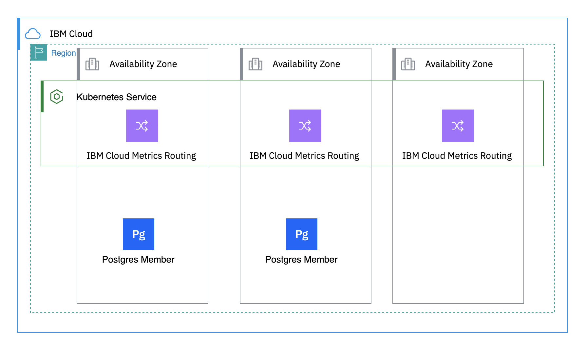
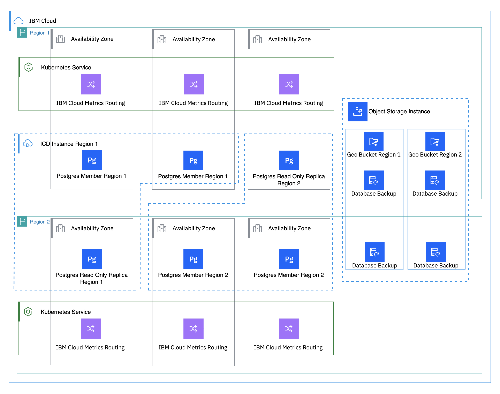

---

copyright:
  years:  2023, 2025
lastupdated: "2025-03-24"

keywords: HA for IBM Cloud Metrics Routing, DR for IBM Cloud Metrics Routing, IBM Cloud Metrics Routing recovery time objective, IBM Cloud Metrics Routing recovery point objective

subcollection: metrics-router

---

{{site.data.keyword.attribute-definition-list}}

# Understanding high availability and disaster recovery for {{site.data.keyword.metrics_router_full_notm}}
{: #metrics-router-ha-dr}

[High availability](#x2284708){: term} (HA) is the ability for a service to remain operational and accessible in the presence of unexpected failures. [Disaster recovery](#x2113280){: term} is the process of recovering the service instance to a working state.
{: shortdesc}

[High availability](#x2284708){: term} (HA) is a core discipline in an IT infrastructure to keep your apps up and running, even after a partial or full site failure. The main purpose of high availability is to eliminate potential points of failures in an IT infrastructure.

{{site.data.keyword.metrics_router_full}} is a highly available, multi-tenant, platform service.

You can find the supported region and data center locations in the [Locations](/docs/metrics-router?topic=metrics-router-regions) documentation. As a regional service, {{site.data.keyword.metrics_router_full_notm}} fulfills the defined [Service Level Objectives (SLO)](/docs/resiliency?topic=resiliency-slo). The SLO is not a warranty and IBM will not issue credits for failure to meet an objective.

## High availability architecture
{: #ha-architecture}

{: caption="High availability architecture" caption-side="bottom"}

{{site.data.keyword.databases-for-postgresql_full}} controls distribution of requests between postgres members, which is outlined in [High availability for PostgreSQL](/docs/databases-for-postgresql?topic=databases-for-postgresql-postgresql-ha-dr)

{{site.data.keyword.metrics_router_full_notm}} is available in multiple regions. For more information on the regions where {{site.data.keyword.metrics_router_full_notm}} is available, see [Regions](/docs/metrics-router?topic=metrics-router-regions).

- Each region has three different data centers for redundancy configured in `active/active` mode.

- If all the data centers in a location fail, {{site.data.keyword.metrics_router_full_notm}} becomes unavailable in that location.

- In each supported region, traffic is load balanced across the infrastructure in multiple availability zones, with no single point of failure.

For more information about service availability, see [Service Level Agreements (SLAs)](/docs/overview?topic=overview-slas).

The following table lists the high-availability (HA) status for the regions (locations) where the {{site.data.keyword.at_full_notm}} service is available:

| Geography             | Region                   | EU-Supported | HA Status |
|-----------------------|--------------------------|--------------|-----------|
| Asia Pacific        | Osaka (`jp-osa`)        | [Not applicable]{: tag-cool-gray}  | `MZR`     |
| Asia Pacific        | Sydney (`au-syd`)        | [Not applicable]{: tag-cool-gray}  | `MZR`     |
| Asia Pacific        | Tokyo (`jp-tok`)        | [Not applicable]{: tag-cool-gray}  | `MZR`     |
| Europe              | Frankfurt (`eu-de`)      | [Yes]{: tag-green}        | `MZR`     |
| Europe              | London (`eu-gb`)         | [Not applicable]{: tag-cool-gray}        | `MZR`     |
| Europe              | Madrid (`eu-es`)         | [Yes]{: tag-green}        | `MZR`     |
| North America       | Dallas (`us-south`)      | [Not applicable]{: tag-cool-gray}        | `MZR`     |
| North America       | Toronto (`ca-tor`)   | [Not applicable]{: tag-cool-gray}        | `MZR`     |
| North America       | Washington DC (`us-east`)   | [Not applicable]{: tag-cool-gray}        | `MZR`     |
| South America       | Sao Paulo (`br-sao`)   | [Not applicable]{: tag-cool-gray}        | `MZR`     |
{: caption="List of locations where the service is available." caption-side="top"}

Where
* A *geography* is a geographic area or larger political body that contains one or more regions.
* A *region* is a defined geographic territory.

    A region could be a specific postal code area, a town, a city, a state, a group of states, or even a group of countries.

    A region contains [multiple availability zones](https://www.ibm.com/cloud/data-centers/){: external} to meet local access, low latency, and security requirements for the region.

* `N/A` means feature that is not applicable to that geography.
* `MZR` means multi-zone region. [Learn more](/docs/overview?topic=overview-locations#table-mzr).

### High availability features
{: #ha-features}

{{site.data.keyword.metrics_router_full_notm}} supports the following high availability features:

| Feature | Description |
| -------------- | -------------- |
| Multi-zone region deployment | {{site.data.keyword.metrics_router_full_notm}} is deployed into multi-zone regions (MZRs), and within a MZR, the data plane spans all three zones, ensuring that the loss of a zone does not impact service availability. |
| Platform metric replication across zones | Metrics ingested into {{site.data.keyword.metrics_router_full_notm}} are replicated across three zones within MZRs |
| Liveness / readiness monitoring | All microservices are monitored via Kubernetes liveness and readiness probes.
{: caption="HA features for {{site.data.keyword.metrics_router_full_notm}}" caption-side="bottom"}

## Disaster recovery architecture
{: #disaster-recovery-intro}

{: caption="Disaster recovery architecture" caption-side="bottom"}

{{site.data.keyword.databases-for-postgresql_full}} controls distrubution of requests between postgres members, which is outlined in [High availability for PostgreSQL](/docs/databases-for-postgresql?topic=databases-for-postgresql-postgresql-ha-dr)

{{site.data.keyword.cos_full_notm}} manages the geo buckets used to store the postgres backups for {{site.data.keyword.metrics_router_full_notm}}. Geo location bucket management is outlined in [High availability for {{site.data.keyword.cos_full_notm}}](/docs/cloud-object-storage?topic=cloud-object-storage-cos-ha-dr)

### Single zone failure
{: #single-az-failure}

{{site.data.keyword.metrics_router_full_notm}} is HA and can continue to function through any single zone or
machine failure.

### Regional failure
{: #regional-failure}

{{site.data.keyword.metrics_router_full_notm}} is a platform service. There is no automatic cross-regional failover or cross-regional disaster recovery. If all of the availability zones in a region fail, {{site.data.keyword.metrics_router_full_notm}} becomes unavailable in that region.

### Disaster recovery features
{: #dr-features}

{{site.data.keyword.metrics_router_full_notm}} supports the following disaster recovery features:

| Feature | Description | Consideration |
| -------------- | -------------- | -------------- |
| Multiple configurable destinations | Details can be found for customers to create disaster resiliant configurations using {{site.data.keyword.metrics_router_full_notm}} [here](/docs/metrics-router?topic=metrics-router-dr_config)| Configuration must be implemented by the customer. |
| Cross site read-only replica for customer's metadata | Customer target and route configurations within {{site.data.keyword.metrics_router_full_notm}} are maintained in a regional database instance as well as in a read-only replica in the recovery region. The replica can be used in the event of a regional disaster to restore the region's metadata| For more information, see [High availability for PostgreSQL](/docs/databases-for-postgresql?topic=databases-for-postgresql-postgresql-ha-dr) |
| Cross site database backup for customer's metadata | Customer target and route configurations within {{site.data.keyword.metrics_router_full_notm}} are maintained in a cross regional {{site.data.keyword.cos_full_notm}} bucket in the recovery geo. This backup can be used in the event of a regional disaster to restore the region's metadata | For more information see [{{site.data.keyword.cos_full_notm}} cross region endpoints](/docs/cloud-object-storage?topic=cloud-object-storage-endpoints#endpoints-geo) |
{: caption="DR features for {{site.data.keyword.metrics_router_full_notm}}" caption-side="bottom"}

### Planning for DR
{: #features-for-disaster-recovery}

The DR steps must be practiced regularly. As you build your plan, consider the following failure scenarios and resolutions.

| Failure | Resolution |
| -------------- | -------------- |
| Hardware failure (single point) | No configuration required. |
| Zone failure | No configuration required. |
| Metadata corruption | In the event of metadata corruption the {{site.data.keyword.metrics_router_full_notm}} service will first attempt to restore using a point-in-time backup from the regional database. If the database is no longer available in the region, the cross regional replica will be promoted to be the primary. If the cross regional replica is unavailable, the database will be restored from the cross regional {{site.data.keyword.cos_full_notm}} backup |
| Regional failure | Follow the steps under [Your responsibilities for HA and DR](#feature-responsibilities). |
{: caption="DR scenarios for {{site.data.keyword.metrics_router_full_notm}}" caption-side="bottom"}

## Your responsibilities for HA and DR
{: #feature-responsibilities}

Disaster recovery is about surviving a catastrophic failure or loss of availability in one location.

{{site.data.keyword.metrics_router_full_notm}} is a platform service, there is no automatic cross-regional failover or cross-regional disaster recovery. If all of the availability zones in a region fail, {{site.data.keyword.metrics_router_full_notm}} becomes unavailable in that region.

[You can create a configuration to route to a backup target in a different region.](/docs/metrics-router?topic=metrics-router-dr_config)
{: tip}

In the event of a regional disaster, you must complete the following steps to establish cross-region high availability:

1. Decide which location is going to be your recovery region. Choose 1 of the following options:

    - [Check the suggested DR recovery region](#bc-dr-locations) and use that region as your recovery region.

    - If you have configured the {{site.data.keyword.metrics_router_full_notm}} account settings with a primary location and a secondary backup location, check if either location is still operational and use the one that is still operational as your recovery region.

    - If you have configured the {{site.data.keyword.metrics_router_full_notm}} account settings with a primary location only, and this location is down, check {{site.data.keyword.metrics_router_full_notm}} supported regions and choose an active region as your recovery region.

2. You can only define targets in {{site.data.keyword.metrics_router_full_notm}} supported regions. However, the actual target can be available in a different region and continue to be operational. First, you must check the target's availability. Next, choose 1 of the following options:

    - If a target is available in a different region from the one that is down, and the recovery region that you choose is one configured in the {{site.data.keyword.metrics_router_full_notm}} account settings, the primary location and backup secondary location include details of your target. You can continue to check the routes that are defined in the account to ensure that platform metrics are routed to the target.

    - If a target is available in a different region from the one that is down, and the recovery region that you choose is not a region that is configured in the {{site.data.keyword.metrics_router_full_notm}} account settings, you must configure the target in any {{site.data.keyword.metrics_router_full_notm}} supported region that is available, preferably, the region that you choose as your recovery region. Next, you must check the routes that are defined in the account so platform metrics are routed to the new target that you have configured.

    - If the target is not available, you must go through the DR recovery process of that type of target and provision a new one in the recovery region that you choose. You must configure the target in any {{site.data.keyword.metrics_router_full_notm}} supported region that is available, preferably, the region that you choose as your recovery region. Next, you must check the routes that are defined in the account so platform metrics are routed to the new target that you have configured.

3. You define routes to indicate how platform metrics are routed to the targets that you have configured in the account. These routes are global and not bound to a specific region. Therefore, in the case of a DR scenario, you must check that all the targets that are configured are operational, and that the rules apply to operational targets and locations.

When {{site.data.keyword.metrics_router_full_notm}} recovers in the region that is down, your configuration is restored. Complete the following steps to continue operating in the region that went down:

1. You must check that any existing targets in that region are also recovered and operational.

2. If you had configured new targets, you can update your configuration to go back to use the targets that went down. You can also decide to continue using the targets that you enabled in the recovery region.

To find out more about responsibility ownership between you and {{site.data.keyword.cloud_notm}} for using {{site.data.keyword.metrics_router_full_notm}}, see [Shared responsibilities for {{site.data.keyword.metrics_router_full_notm}}](/docs/metrics-router?topic=metrics-router-shared-responsibilities).

## Recovery time objective (RTO) and recovery point objective (RPO)
{: #rto-rpo-features}

{{site.data.keyword.cloud_notm}} has [business continuity](#x3026801){: term} plans in place to provide for the recovery of services within hours if a disaster occurs. You are responsible for your data backup and associated recovery of your content.

{{site.data.keyword.metrics_router_full_notm}} provides mechanisms to protect your data and restore service functions. Business continuity plans are in place to achieve targeted [recovery point objective](#x3429911){: term} (RPO) and [recovery time objective](#x3167918){: term} (RTO) for the service. The following table outlines the targets for {{site.data.keyword.metrics_router_full_notm}}.

| Recovery objective for DR                                         | Estimated time |
|-------------------------------------------------------------------|----------------|
| Maximum Tolerable Downtime (MTD) / Recovery Time Objective (RTO)  | Less than 24 hours |
| Recovery Point Objective (RPO)                                    | Less than 24 hours |
{: caption="RPO and RTO for {{site.data.keyword.metrics_router_full_notm}}" caption-side="bottom"}

## Change management
{: #change-management}

Change management includes tasks such as upgrades, configuration changes, and deletion.

It is recommended that you grant users and processes the IAM roles and actions with the least privilege required for their work. See [How can I prevent accidental deletion of services?](/docs/resiliency?topic=resiliency-dr-faq#prevent-accidental-deletion).

## How {{site.data.keyword.IBM}} helps ensure disaster recovery
{: #ibm-disaster-recovery}

- {{site.data.keyword.IBM}} conducts annual tests of various disaster scenarios and continuously refines our recovery documentation based on findings that are found during these tests.
- 24 × 7 global support is available to customers with {{site.data.keyword.IBM}} Subject Matter Experts who are on call to help in the case of a disaster.

   All {{site.data.keyword.IBM}} Subject Matter Experts are trained annually on business continuity and disaster recovery policies and procedures to ensure preparedness in the event of a disaster.

The metadata that is managed by {{site.data.keyword.metrics_router_full_notm}} in a region is kept in the data centers near that region.

A multizone region (MZR) consists of 3 or more availability zones that are independent from each other to ensure that single failure metrics affect only a single zone.

By default, {{site.data.keyword.metrics_router_full_notm}} is deployed across 3 zones. Each zone is set up with `active/active/active`:
* Each zone is located in a different data center in the region.
* The platform metrics in each zone are automatically replicated to the other zones with low latency. You don't need to do anything to enable the replication.
* The service is designed to withstand a single zone failure with no interruption.

The MZR architecture offers automatic failover between zones within the region, and high availability for an instance withing a region.

{{site.data.keyword.metrics_router_full_notm}} metadata includes information on where and how to collect and store metrics in your account.
- A target defines a resource where you can collect metrics.
- A route defines the rules that determine where metrics are routed in your account or cross-account.

{{site.data.keyword.metrics_router_full_notm}} does regular backups of the metadata per region:
- The settings metadata locations indicate the region where metadata is backed up.
- Regular backups are done daily.
- {{site.data.keyword.metrics_router_full_notm}} metadata is replicated across regions based on your account configuration for the primary and backup metadata locations.

{{site.data.keyword.metrics_router_full_notm}} metadata is replicated across multiple regions.
- Regular backups are stored across multiple regions, and are restorable to other regions.

The following table shows the regions where the copy of a regular backup is replicated and available:

| Geography             | Region                   | Other regions that keep a copy of the backup   |
|-----------------------|--------------------------|-------------------------|
| Asia Pacific        | Osaka (`jp-osa`)        | Tokyo (`jp-tok`)     |
| Asia Pacific         | Sydney (`au-syd`)        | London (`eu-gb`)        |
| Asia Pacific        | Tokyo (`jp-tok`)        | Osaka (`jp-osa`)     |
| Europe               | Frankfurt (`eu-de`)      | Madrid (`eu-es`)        |
| Europe               | London (`eu-gb`)         | Sydney (`au-syd`)       |
| Europe               | Madrid (`eu-es`)         | Frankfurt (`eu-de`)     |
| North America        | Dallas (`us-south`)      | Washington (`us-east`)  |
| North America        | Toronto (`ca-tor`)       | Washington (`us-east`)  |
| North America        | Washington (`us-east`)   | Dallas (`us-south`)     |
| South America        | Sao Paulo (`br-sao`)     | Washington (`us-east`)  |
{: caption="List of locations where a copy of the backup is available" caption-side="top"}

For more information about service availability within regions and data centers, see [Service and infrastructure availability by location](/docs/overview?topic=overview-services_region).

The following table indicates the recovery region in the event of a DR situation:
{: #bc-dr-locations}

| Geography             | Source region            | Recovery region   |
|-----------------------|--------------------------|--------------|
| Asia Pacific        | Osaka (`jp-osa`)        | Tokyo (`jp-tok`)     |
| Asia Pacific        | Sydney (`au-syd`)        | Frankfurt (`eu-de`)     |
| Asia Pacific        | Tokyo (`jp-tok`)        | Osaka (`jp-osa`)     |
| Europe              | Frankfurt (`eu-de`)      | Madrid (`eu-es`)        |
| Europe              | London (`eu-gb`)         | Frankfurt (`eu-de`)     |
| Europe              | Madrid (`eu-es`)         | Frankfurt (`eu-de`)     |
| North America       | Dallas (`us-south`)      | Washington (`us-east`)  |
| North America       | Toronto (`ca-tor`)       | Washington (`us-east`)  |
| North America       | Washington DC (`us-east`)   | Dallas (`us-south`)     |
| South America       | Sao Paulo (`br-sao`)     | Washington (`us-east`)     |
{: caption="List of locations where a region is recovered" caption-side="top"}

### How {{site.data.keyword.IBM_notm}} recovers from zone failures
{: #ibm-zone-failure}

In case of zone failure, IBM Cloud will resolve the zone outage. Since the service spans across all three zones in a region, there will be no impact to service availability within a MZR. Upon zone recovery, events and API requests will resume sending to the restored zone. There will be no need for customer action at this time.

### How {{site.data.keyword.IBM_notm}} recovers from regional failures
{: #ibm-regional-failure}

When {{site.data.keyword.metrics_router_full_notm}} recovers in the region that is down, your configuration is restored. Complete the following steps to continue operating in the region that went down:

1. You must check that any existing targets in that region are also recovered and operational by confirming platform metrics are routed to the configured target destinations.

2. If you had configured new targets, you can update your configuration to go back to use the targets that went down. You can also decide to continue using the targets that you enabled in the recovery region.

To find out more about responsibility ownership between you and {{site.data.keyword.cloud_notm}} for using {{site.data.keyword.metrics_router_full_notm}}, see [Shared responsibilities for {{site.data.keyword.metrics_router_full_notm}}](/docs/metrics-router?topic=metrics-router-shared-responsibilities).

If the customer follows these steps and followed [disaster resiliant configuration](/docs/metrics-router?topic=metrics-router-dr_config), platform metrics should flow to the originally configured destination for the recovered region, once services sending platform metrics are restored and begin sending platform metrics to the recovered {{site.data.keyword.metrics_router_full_notm}} instance.

All upgrades follow the {{site.data.keyword.IBM_notm}} service best practices and have a recovery plan and rollback process in-place. Regular upgrades for new features and maintenance occur as part of normal operations. Such maintenance can occasionally cause short interruption intervals that are handled by [client availability retry logic](/docs/resiliency?topic=resiliency-high-availability-design#client-retry-logic-for-ha). Changes are rolled out sequentially, region by region and zone by zone within a region. Updates are backed out at the first sign of a defect.

Complex changes are enabled and disabled with feature flags to control exposure.

Changes that impact customer workloads are detailed in notifications. For more information, see [monitoring notifications and status](/docs/account?topic=account-viewing-cloud-status) for planned maintenance, announcements, and release notes that impact this service.
