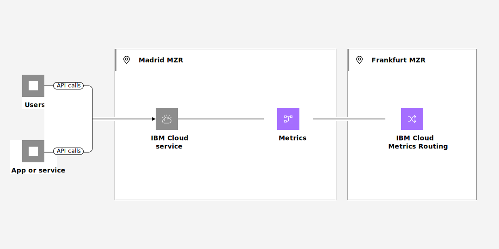

---

copyright:
  years:  2023, 2024
lastupdated: "2024-10-09"

keywords:

subcollection: metrics-router

---

{{site.data.keyword.attribute-definition-list}}

# Working with metrics in a region where {{site.data.keyword.metrics_router_full_notm}} is not available
{: #manage-metrics-for-new-region}

In {{site.data.keyword.cloud_notm}}, platform metrics that are generated by {{site.data.keyword.cloud_notm}} services in a region, location, or datacenter where the {{site.data.keyword.metrics_router_full_notm}} service is not available might be managed through a different region.
{: shortdesc}

You can monitor metrics in your account for example, for DevOps or troubleshooting. Services that generate platform metrics in a location where the {{site.data.keyword.metrics_router_full_notm}} service is not available can send metrics to a different region where the {{site.data.keyword.metrics_router_full_notm}} service is available. You can monitor what is happening in the {{site.data.keyword.cloud_notm}} for that service at all times.

{: caption="Platform metrics flow that are generated by {{site.data.keyword.cloud_notm}} services in a region, location, or datacenter where the {{site.data.keyword.metrics_router_full_notm}} service is not available can be managed through a different region" caption-side="bottom"}

## Understanding platform metrics
{: #manage-metrics-for-new-region-metrics}

{{site.data.keyword.mon_full_notm}} provides dashboards that allow you to gain operational visibility into the performance and health of your applications, services and platforms. You can monitor and troubleshoot issues and define alerts based on specific operational criteria.  You can also create custom dashboards to meet your organization's needs.

Platform metrics are metrics that are generated by {{site.data.keyword.cloud_notm}} services. By default, platform metrics are available through the {{site.data.keyword.mon_full_notm}} instance that is available in the same region where the service that generates it is available. However, you can use {{site.data.keyword.metrics_router_full_notm}} to provide additional flexibility and route platform metrics to configured {{site.data.keyword.mon_full_notm}} instances based on defined rules.

Each {{site.data.keyword.cloud_notm}} service documents the metrics that it sends to {{site.data.keyword.metrics_router_full_notm}}.  See [Service generating metrics](/docs/metrics-router?topic=metrics-router-cloud-services-mr) for information on the services sending metrics and the type of metrics that are sent.

## How can you identify data from the Madrid location?
{: #manage-metrics-for-new-region-identify-metrics}

Platform metrics include the field `ibm-location` that specifies the region, location, or datacenter where the resource is available. For example, for Madrid, you can see the location of metrics set to `eu-es`.

## Services that operate in new regions
{: #manage-metrics-for-new-region-locations-1}

Select services that are available in the Madrid region send platform metrics that you can manage with the {{site.data.keyword.metrics_router_full_notm}} service to the Frankfurt (EU-DE) region.

- VPC
- {{site.data.keyword.messagehub_full}}
