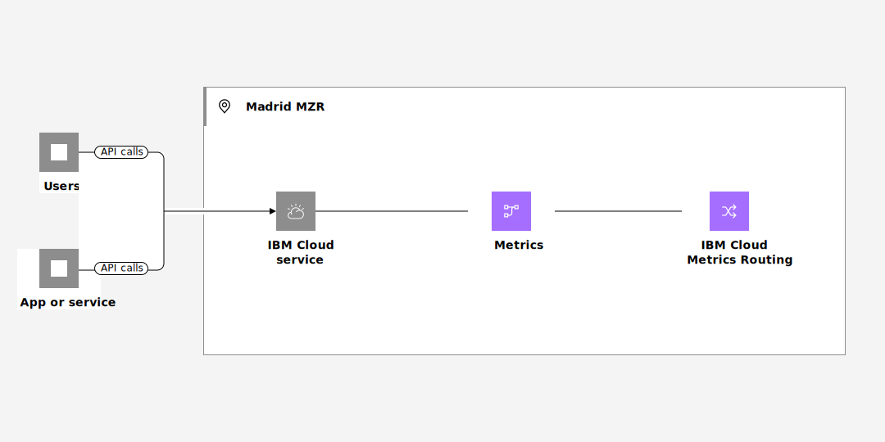

---

copyright:
  years:  2023
lastupdated: "2023-09-13"

keywords:

subcollection: metrics-router

---

{{site.data.keyword.attribute-definition-list}}


# Managing metrics in a new location after {{site.data.keyword.at_short}} is available
{: #manage-metrics-to-new-region}

To manage metrics from {{site.data.keyword.cloud_notm}} services that generate platform metrics in a new region where the {{site.data.keyword.metrics_router_full_notm}} service is not available until a later date, complete these instructions.
{: shortdesc}

For example, the Madrid region opened for business in June 2023. {{site.data.keyword.cloud_notm}} services that are available and generate platform metrics send currently those metrics to the Frankfurt region. You can manage and monitor interaction with these services in Frankfurt. Platform metrics include the field `ibm-location` that specifies the region, location, or datacenter where the resource is available. For example, for Madrid, you can see the location of platform metrics set to `eu-es`.


You cannot control when an {{site.data.keyword.cloud_notm}} service makes the switch of sending platform metrics from one region to another one. However, you can add a new rule for Madrid to prepare for that switch.

Data is not sent to both locations, complete the steps before that switch is done by a service to mitigate any loss of data.

{: caption="Figure 1. Flow of metrics in a single region" caption-side="bottom"}


## Step 1. Configure targets in Madrid
{: #manage-metrics-to-new-region-1}

A target defines where platform metrics are collected. For more information about targets, see [Understanding how targets work in your account](/docs/metrics-router?topic=metrics-router-target&interface=cli#target_behavior).

[Configure a {{site.data.keyword.mon_short}} target in Madrid](/docs/metrics-router?topic=metrics-router-target-manage).


## Step 2. Configure or modify a route to include a rule for Madrid
{: #manage-metrics-to-new-region-2}


A route defines the rules that indicate where platform metrics that are generated in an account are routed. Routes are global under an account and are evaluated in all regions where {{site.data.keyword.atracker_short}} is deployed. For more information, see [Understanding how routes work in your account](/docs/metrics-router?topic=metrics-router-routes&interface=cli#route_behaviour) and [Routing metrics from 1 location](/docs/metrics-router?topic=metrics-router-route-from-1-location&interface=cli).

For example, in this step, you will reconfigure a route to redirect metrics that are generated in Madrid.

Run the following command to create the route:

```text
ibmcloud atracker route update --route <ROUTE_NAME> --rules
```
{: pre}

Where

`--route <ROUTE_NAME>`
:   The name of the route.

`--rules <ROUTING_RULES>`
:   A JSON formatted rule definition enclosed in single quotes. You must keep existing rules and add new rules for Madrid. For example:

    ```json
    --rules '[{"action": "send", "targets":[{"id":"2222222-1111-1111-1111-1111111111111"}], "inclusion_filters":[{"operand": "location","operator": "is","values": "eu-de"}]},{"action": "send", "targets":[{"id":"11111111-1111-1111-1111-1111111111111"}], "inclusion_filters":[{"operand": "location","operator": "is","values": "eu-es"}]}]'
    ```
    {: codeblock}

After you configure a route, it might take up to 1 hour for the configuration to be enabled.
{: note}

For example, to create a route to send metrics generated in eu-es to the target that you created in the previous step, run the following command.

```text
ibmcloud metrics-router route create --name "my-route" --rules '[{"action": "send", "targets":[{"id":"TARGETID"}], "inclusion_filters":[{"operand": "location","operator": "is","values": "eu-es"}]}]''
```
{: pre}

Where `TARGETID` is the ID of the target that you created in the previous step.
