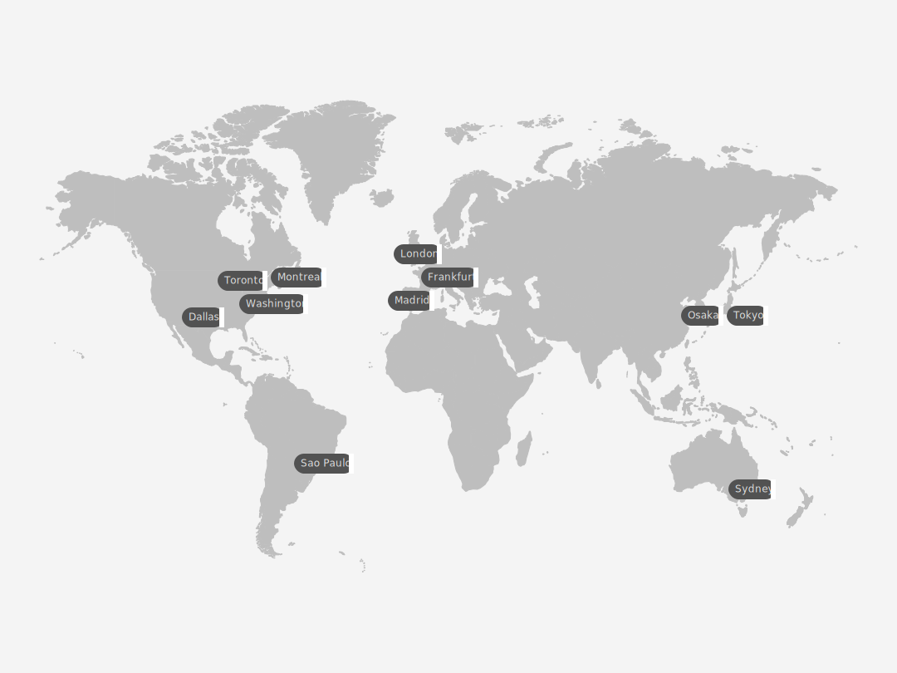

---

copyright:
  years:  2023, 2025
lastupdated: "2025-10-21"

keywords:

subcollection: metrics-router

---

{{site.data.keyword.attribute-definition-list}}

# Locations
{: #regions}

{{site.data.keyword.metrics_router_full_notm}} is available in the following locations:
{: shortdesc}

{: caption="Displays the regions where you can create and manage {{site.data.keyword.metrics_router_full_notm}} resources." caption-side="bottom"}

| Geography             | Region                       | EU-Supported | HA Status |
|-----------------------|------------------------------|--------------|-----------|
| Asia Pacific        | Osaka (`jp-osa`)            | [Not applicable]{: tag-cool-gray}        | `MZR`     |
| Asia Pacific        | Sydney (`au-syd`)            | [Not applicable]{: tag-cool-gray}        | `MZR`     |
| Asia Pacific        | Tokyo (`jp-tok`)            | [Not applicable]{: tag-cool-gray}        | `MZR`     |
| Europe              | Frankfurt (`eu-de`) `[*]`      | [Yes]{: tag-green}        | `MZR`     |
| Europe              | London (`eu-gb`)             | [Not applicable]{: tag-cool-gray}         | `MZR`     |
| Europe              | Madrid (`eu-es`) `[*]`      | [Yes]{: tag-green}        | `MZR`     |
| North America       | Dallas (`us-south`)          | [Not applicable]{: tag-cool-gray}        | `MZR`     |
| North America       | Montreal (`ca-mon`)    | [Not applicable]{: tag-cool-gray}        | `MZR`     |
| North America       | Toronto (`ca-tor`)    | [Not applicable]{: tag-cool-gray}        | `MZR`     |
| North America       | Washington DC (`us-east`)    | [Not applicable]{: tag-cool-gray}        | `MZR`     |
| South America       | Sao Paulo (`br-sao`)    | [Not applicable]{: tag-cool-gray}       | `MZR`     |
{: caption="List of locations for {{site.data.keyword.metrics_router_full_notm}}" caption-side="top"}

Where
* A *geography* is a geographic area or larger political body that contains one or more regions.
* A *region* is a defined geographic territory. A region could be a specific postal code area, a town, a city, a state, a group of states, or even a group of countries.
* `N/A` means feature that is not applicable to that geography.
* For information about region types, see [IBM Cloud region and data center locations for resource deployment](/docs/overview?topic=overview-locations).

`[*]` For more information, see [Enabling EU support for your account](/docs/account?topic=account-eu-supported).
