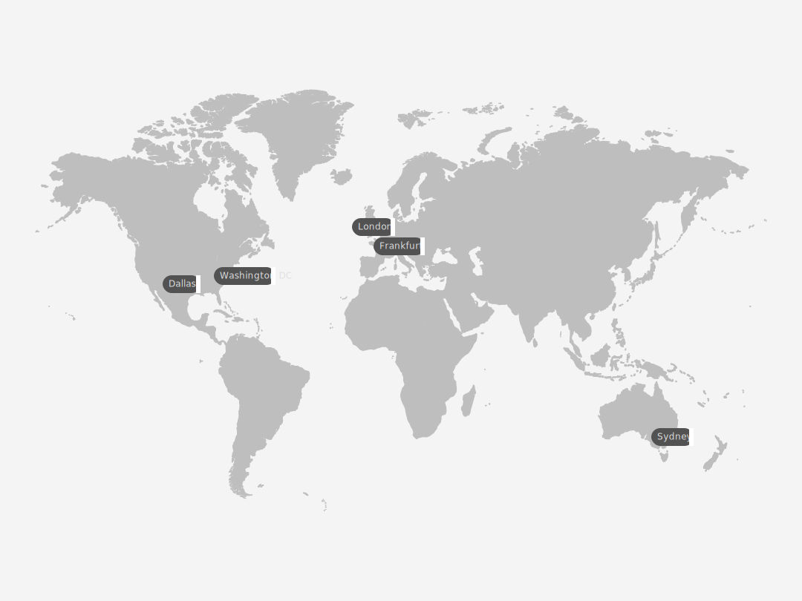

---

copyright:
  years:  2022, 2023
lastupdated: "2023-06-06"

keywords:

subcollection: metrics-router

---

{{site.data.keyword.attribute-definition-list}}

# Locations
{: #regions}

{{site.data.keyword.metrics_router_full_notm}} is available in the following locations:
{: shortdesc}

{: caption="Figure 1. Displays the regions where you can create and manage {{site.data.keyword.metrics_router_full_notm}} resources." caption-side="bottom"}

| Geography             | Region                       | EU-Supported | HA Status |
|-----------------------|------------------------------|--------------|-----------|
| `Asia Pacific`        | `Sydney (au-syd)`            | `N/A`        | `MZR`     |
| `Europe`              | `Frankfurt (eu-de) [*]`      | `YES`        | `MZR`     |
| `Europe`              | `London (eu-gb)`             | `NO`         | `MZR`     |
| `North America`       | `Washington DC (us-east)`    | `N/A`        | `MZR`     |
| `North America`       | `Dallas (us-south)`          | `N/A`        | `MZR`     |
{: caption="Table 1. List of locations for {{site.data.keyword.metrics_router_full_notm}}" caption-side="top"}

Where
* A *geography* is a geographic area or larger political body that contains one or more regions.
* A *region* is a defined geographic territory. A region could be a specific postal code area, a town, a city, a state, a group of states, or even a group of countries.
* `N/A` means feature that is not applicable to that geography.

`[*]` For more information, see [Enabling EU support for your account](/docs/account?topic=account-eu-supported).
